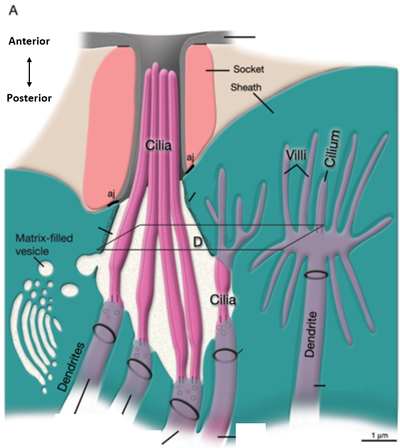
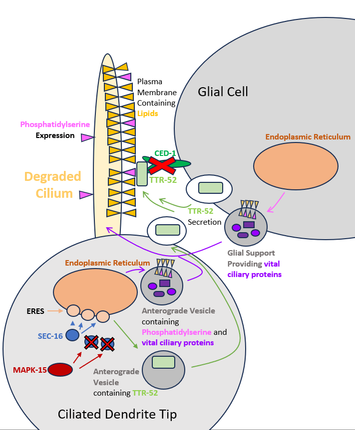
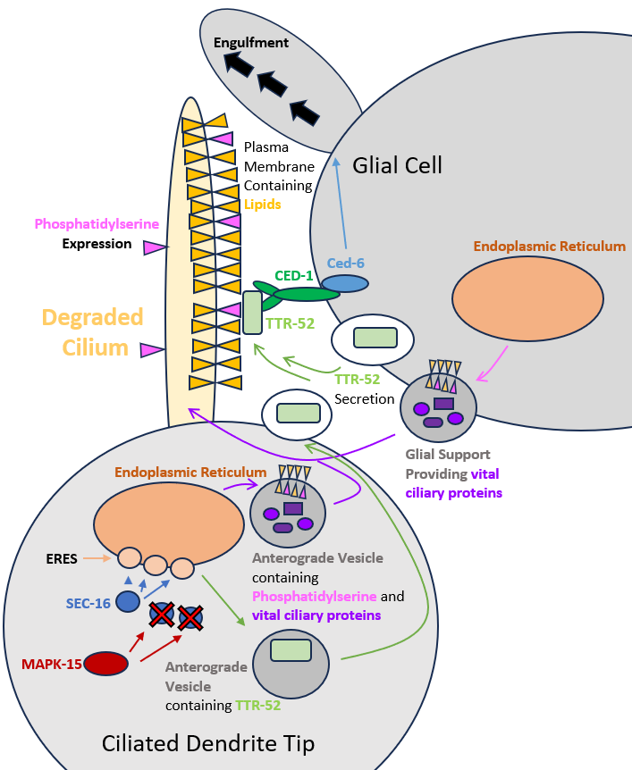
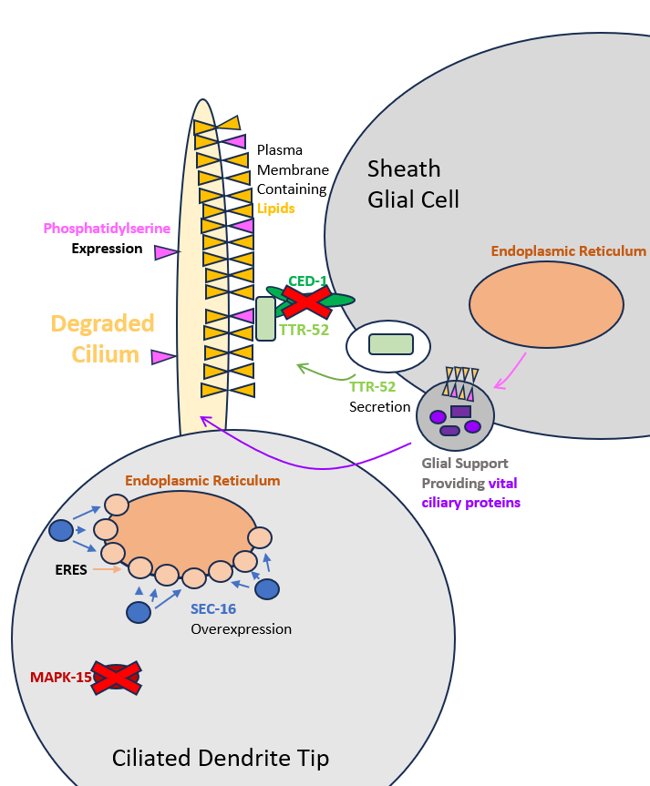
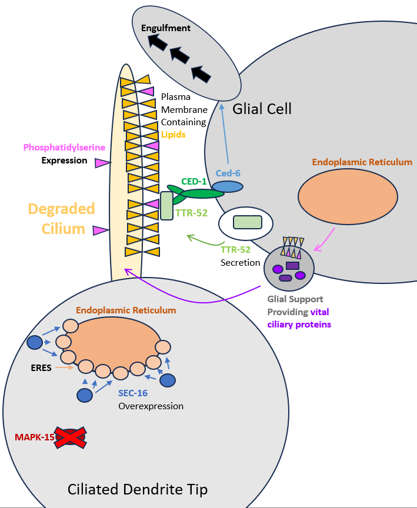

## Abstract

Cilia play major roles in human biology, and their dysfunction is linked to many diseases. Cilia function relies on a plethora of proteins and pathways. Previous research has shown that loss of function of CED-1 and MAPK-15 has led to synergistic defects in cilia function. However, CED-1 and MAPK-15 interaction remains unknown. We argue that MAPK-15 damage causes ciliary defects which rely on CED-1 and glial cells for regeneration and rescue. To build a testable model of their interaction, we review specific processes involved in cilia growth and maintenance that act upstream or downstream of MAPK-15 and CED-1.

## Introduction

Cilia are microtubule-based organelles that project from cell surfaces in virtually all eukaryotic organisms (Inglis *et al.,* 2007). Cilia take on two different forms, motile and non-motile, each with different functions. For example, motile cilia found in epithelial cells within humans beat synchronously to move mucus. Each epithelial cell may have 200--300 cilia (cite). Non-motile cilia detect mechanical and chemical stimuli and play a major role in cell-to-cell signaling with roles in regulating cell proliferation and maintaining tissue homeostasis (Berbari *et al.,* 2009). Non-motile cilia can be found on nearly every human cell. Cilia are complex organelles that require a wide variety of proteins for assembly and maintenance.

Motile and non-motile cilia (Fig. 1) protrude from the surface of cells and are anchored to the cell by basal bodies. From these basal bodies, the axonemal core extends, providing support. The non-motile axoneme consists of nine outer microtubule doublets arranged around the center in a configuration known as 9+0. Motile ciliary axonemes are characterized by a 9+2 architecture with nine outer microtubule doublets plus a central pair of microtubules, utilized by linked motor proteins called dynein arms for movement (Klena *et al.,* 2022).

Cilia do not have the ability to synthesize proteins on their own and rely on anterograde transport, the movement of vesicles from the endoplasmic reticulum and golgi apparatus, to form and operate. Proteins need to pass through the "transition zone," a membrane-rich area that regulates the entry of proteins into and out of the cilium. Once past the transition zone, the Interflagellar Transport (IFT) mechanism is responsible for shuttling proteins into, out of, and within the cilia (Meleppattu *et al.,* 2023).

![**Figure 1. Cilia Structure.** The cilia membrane encloses the axonemal core (A), made up of 9+0 or 9+2 microtubule pairs in non-motile (B) and motile cilia (C). The cilia membrane contains proteins and receptors necessary for cilia function. The basal body at the base of the cilia dictates microtubule organization and anchors cilia below the cell surface. The transition zone acts as a boundary, keeping proteins out of and accepting others into the extracellular port of the cilia. Figure modified from <https://ciliopathyalliance.org/cilia>.](images/image1.png){#fig-cilia-structure width=85%}

The processes responsible for transporting proteins to the cilia play a key role in ciliary health.

## Ciliopathies

Ciliopathies are diseases characterized by dysfunction of cilia. These disorders are largely caused by single-gene mutations in proteins required for ciliary growth and maintenance. Depending on the protein damage, many different diseases can occur. Primary Ciliary Dyskinesia occurs when motile cilia in the lungs stop beating synchronically to move mucus, dust, and bacteria, leading to chronic infections (Sagel *et al.,* 2011). Polycystic Kidney Disease (PKD) is the most common potentially lethal genetic disorder in humans (Grantham *et al.,* 2001). PKD is caused by damage to non-motile cilia, leading to the formation of cysts and eventual kidney failure due to the breakdown of cell-to-cell signaling (Liwei Huang *et al.,* 2014). Damage to proteins responsible for building and upkeeping the transition zone have been linked to thirteen diseases (Gonçalves *et al.,* 2017). There are 35 known disorders given the broad term ciliopathies. Understanding the pathways responsible for ciliary function is crucial to treating and preventing ciliopathies.

Cilia are highly conserved throughout evolution within eukaryotes due to their important roles for organism survival. Homologs are genes or proteins in different species that share a common evolutionary ancestor and often retain similar functions. Humans share 87 conserved homologs with *Chlamydomonas reinhardtii* (Pazour 2005), or green algae, relatively a much simpler organism. This suggests that the molecular blueprint of cilia is evolutionarily ancient, likely existing in the last eukaryotic common ancestor. Because core ciliary protein mechanisms are conserved, studies in simpler model organisms provide critical insight into the molecular basis of human ciliopathies.

## *C. elegans* as a Model for Investigating Cilia Function

*Caenorhabditis elegans* is an ideal model organism for investigating cilia function. These organisms have been heavily studied for many years, with their first mention in a paper coming from 1899. Then, from 1963 to 1965, Sydney Brenner spearheaded the adoption of *C. elegans* as a model organism due to its low cell count, ease of reproduction, and transparent body, all reasons they are still prevalent today. The only ciliated cells within *C. elegans* are in the central nervous system (Inglis *et al.,* 2005--2018), making them suitable for mutagen-based studies looking into cilia. Mutagen-based studies mutate a protein, causing dysfunction, to reveal its role and the phenotype resulting from its damage. Typically, this dysfunction could prevent organisms from developing properly as, but not in *C. elegans* due to cilia being confined to ciliated dendrites.

*C. elegans* are ideal for studying proteins. While *C. elegans* are primarily hermaphrodites, males do occur, enabling crosses between transgenic strains provided the mutant males do not have mating defects. This avoids the need for costly transgene microinjection when a genetic cross between mutant strains is sufficient. Due to their transparent bodies, chimeric proteins can be created by adding a fluorescent marker to the protein of interest, enabling research into the localization of proteins required for ciliary function within live specimen. There are several robust methods for detecting cilia function in live *C. elegans*. *C. elegans* with functional cilia take up fluorescent dye in six amphid neurons in the head and tail (Starich *et al.,* 1995), whereas *C. elegans* with defective cilia do not (Perkins *et al.,* 1986). *C. elegans* with defective cilia will be unable to avoid regions with high osmotic strength (Culotti & Russel, 1978) and males can have mating defects (O'Hagan *et al.,* 2014).

*C. elegans* contain 303 neurons, 60 of which are ciliated-sensory neurons (CSN), primarily located in the head and tail. Many CSN are located in the head and project from the nerve ring, a region with a dense composition of neuronal connections.

{#fig-amphid-sensilla width=50%}

The primary sensory organs of *C. elegans* are the amphid sensilla located on either side of the head. These are comprised of 12 sensory neurons (White *et al.,* 1986) whose cilia are exposed to the outside world via small crypts in the cuticle (skin) surface. These neurons are specialized to detect salts, deterrents, pH, pheromone and bacterial volatiles (Venkatesh *et al.,* 2023). Another major sensory organ is the phasmid, located in the tail, which also exposes cilia to the environment.

Glial cells provide crucial support to nearby ciliated dendritic cells; in *C. elegans*, 50 glial cells carry out these roles. Socket glial cells guide neurons to specific organs, while sheath glial cells embed sensory neuron receptive endings before exposing them to the outside environment. Each amphid sensilla (Fig. 2) consists of two glial cells, one sheath cell, and one socket cell. Removing the sheath glial cells will cause impaired sensory ability and the degradation of sensory endings. This same effect can be caused by blocking the secretory pathway within these glial cells (Shai Shaham *et al.,* 2015). Without functioning glial cells, ciliated neurons would be dysfunctional.

## MAPK-15

Kinases are essential for cell signaling because they modulate the activity of other molecules by adding phosphate groups to them, activating or deactivating them. Mitogen-activated protein kinases (MAPKs) are a highly conserved family of enzymes that function in a multitude of cellular processes. Mitogens are substances that trigger cell division, which was MAPK's first discovered effect. Despite the name, MAPKs are also highly activated by cell stressors such as DNA damage, low osmolarity, oxidative stress, hyperosmotic stress, etc. MAPK-15 is an atypical kinase that is known to regulate cilia length, but this has a poorly understood pathway.

MAPK-15 has been shown to act upstream of autophagic processes (Colecchia *et al.,* 2012), and when removed, autophagic activity decreases. MAPK-15 activity is increased in response to starvation, DNA damage, and activity of human oncogenes (Colecchia *et al.,* 2018). Additionally, in human and *Drosophila melanogaster* cells, MAPK-15 has been shown to inhibit SEC-16, reducing anterograde transport of proteins, or transport of proteins away from the nucleus (Zacharogianni *et al.,* 2011).

MAPK-15 has a role that is evolutionarily conserved across species in cilium biology and is required for cilia to form properly. MAPK-15 has even been identified in a very early branch of eukaryotic life: single-celled Apicomplexan parasites, which have specialized cilia that fail to form without MAPK-15. This finding suggests that the protein has an ancient and central role in ciliogenesis (O'Shaughnessy *et al.,* 2020). In multi-ciliated Xenopus and mouse cells, MAPK-15 depletion reduces motile cilia number and length. This is caused by defects in the actin network preventing basal body migration (Miyatake *et al.,* 2015). Loss of MAPK-15 function within *C. elegans* or loss of its homologue in human cells causes defects in cilium length, morphology, and function (Piasecki *et al.,* 2017) and disrupts the localization of the basal body and axonemal proteins important for cilium structure, trafficking, and ciliary gating (Kazatskaya *et al.,* 2017). Cilia are unable to properly form across eukaryotic life without MAPK-15.

## SEC-16

SEC-16 is a crucial protein for the function of the endoplasmic reticulum (ER), which has a vital role in the secretory pathway, crucial for cilia health. SEC-16 is responsible for the generation of endoplasmic reticulum exit sites (ERES) (Yorimitsu *et al.,* 2012). At ERES, SEC-16 facilitates the application of the protein coat to vesicles traveling anterograde, or away from the nucleus. Both overexpressing or removing SEC-16 results in the organizational dysfunction of the ER and reductions in anterograde transport (Zacharogianni *et al.,* 2011) crucial to cilia health.

## CED-1

In addition to a functional interaction with SEC-16, it appears that MAPK15 has a surprising connection with CED-1. Cell death abnormality protein 1 (CED-1) is a cell surface receptor that has a vital role in cell death. CED-1 is required for the engulfment of cells undergoing programmed cell death (Zhou *et al.,* 2001) and is expressed primarily around dying cells, where it localizes to the cell surface. CED-1 recognizes dying cells and recruits downstream effectors to enable the engulfment of the dying cell (Raiders *et al.,* 2021). One of these effectors is CED-6, which restructures the cytoskeleton of the engulfing cell. When the CED-1 gene is disrupted, apoptotic cells are not efficiently engulfed or cleared. Removal of dying cells is essential for maintaining tissue homeostasis; in humans, failure of this process can trigger inflammatory responses (Erwig *et al.,* 2008). In mammals, mobile phagocytes express Scavenger Receptor from Endothelial Cells (SREC), a CED-1 homologue, which recognize and engulf apoptotic cells. In contrast, *C. elegans* lack specialized phagocytes and instead rely on neighboring cells for cell-corpse engulfment (Robertson and Thomson 1982; Raiders *et al.,* 2021).

{#fig-phospholipid width=75%}

CED-1 is also involved in regulating neurite pruning, the process of removing axons, essential for neuron health. In *Drosophila melanogaster*, glial cells express their ortholog of CED-1, have been observed to clear apoptotic neurons in the developing central nervous system (Freeman *et al.,* 2003). After this clearance, neurons are prompted to regenerate and reestablish themselves into the neuronal network.

## Phosphatidylserine

Phosphatidylserine (PS) is a negatively charged lipid and a major component of the inner leaflet of the cell membrane (Fig. 3); however, during cell death, PS is expressed on the outer leaflet (VA Fadok *et al.,* 1992). In *C. elegans*, this membrane asymmetry is maintained by specialized enzymes called flippases. It has been proposed that inactivation of these flippases leads to the dysregulation of membrane asymmetry (Segawa *et al.,* 2014), as overtime lipids are able to flip from the inner to outer membrane, or vice versa, without any facilitation.

PS has several transport pathways to the cell membrane and the ciliary membrane. PS can hitch a ride as part of the vesicle released from the endoplasmic reticulum following anterograde transport. PS can also be transported by lipid transport proteins (LTP), which extract PS from the smooth endoplasmic reticulum's cell membrane and transports it to other compartments (Alenka Čopič 2023).

PS is crucial for proper cell engulfment. As previously stated, CED-1 recognizes cell death markers and starts the engulfment process. TTR-52 is a secreted binding protein in *C. elegans* which attaches to PS on the outer leaflet and facilitates the binding of CED-1 (Wang *et al.,* 2011). Both TTR-52 and PS are required for proper engulfment of apoptotic cells by CED-1. In humans, aging is linked to reduced levels of PS, which in turn is linked to cognitive impairment and Alzheimer's disease (Bo-Kyoung Kim *et al.,* 2020), highlighting a potential similar pathway in humans.

## CED-1 and MAPK-15 Interaction

Research done by Kathryn Williams in 2024 revealed that there is an interaction between CED-1 and MAPK-15. If MAPK-15 was damaged, *C. elegans* were dye-filling defective in the phasmid sensilla, indicative of cilia dysfunction, but dye-filled normally in the amphid sensilla. If CED-1 was damaged, *C. elegans* dye-filled normally at both locations. However, if both genes were damaged, *C. elegans* were dye-filling defective at both locations, indicative of high cilia damage. An interaction between these two proteins is evident based on their synergistic effect on cilia dysfunction; however, the mechanism of this interaction is unknown.

::: {layout-ncol=2}
{#fig-pathway-healthy width=50%}

{#fig-pathway-ced1 width=50%}
:::

## Proposed Pathway

Fluorescent microscopy has revealed that MAPK-15 is primarily present within ciliated neurons of *C. elegans* (Piasecki unpublished). MAPK-15 negatively regulates SEC-16 (Zacharogianni *et al.,* 2011), thereby limiting excessive formation of ERES (Yorimitsu *et al.,* 2012) (Fig. 4). ERES are necessary for the export of proteins from the ER, some of which are sent to cilia where they contribute to ciliary maintenance and growth. Among the proteins shipped from ERES is TTR-52, which is excreted. During cell death, PS is exposed on the outer leaflet of the plasma membrane and is bound by secreted TTR-52. TTR-52 is subsequently recognized by CED-1 receptors on neighboring cells (Wang *et al.,* 2011), triggering vast changes to the cytoskeleton that enable the engulfment of damaged cilia leading to cilia regeneration and repair.

## CED-1 Mutant Phenotype

This model can explain the CED-1 mutant phenotype observed by Williams. CED-1 mutants had functional cilia. Within these CED-1 mutants, *C. elegans* had a normal dye-filling phenotype (Williams 2024), meaning cilia are functional. This suggests that CED-1 damage alone is not responsible for dysfunctional cilia. CED-1 damage should only prevent the removal of damaged cilia (Fig. 5), without causing additional harm.

::: {layout-ncol=2}
{#fig-pathway-mapk15 width=50%}

{#fig-pathway-double width=50%}
:::

## MAPK-15 Mutant Phenotype

MAPK-15 mutant *C. elegans* had mild cilia defects. In these mutants, *C. elegans* are dye-filling defective in the phasmid, but not in the head sensilla. This location specific difference in cilia function is likely caused by morphological differences between amphid and phasmid glia, with phasmid glia playing a potentially smaller role in supporting ciliated dendritic tips. Dysfunction is likely caused by overexpression of SEC-16, resulting in excessive ERES, disrupting ER membrane regulation and reducing anterograde vesicles necessary for cilia development (Fig. 6).

Despite this, cilia in the head sensilla remain fully functional, reinforcing the importance of glial cells in secreting proteins critical for ciliary maintenance. MAPK-15 is not expected to impact glial cells, as laser confocal microscopy has not revealed MAPK-15 in glial cells (Piasecki unpublished). Additionally, ciliary lengths in head sensilla are substantially reduced in MAPK-15 mutants (0.28 μm) compared to wildtype (1.27 μm) (Williams 2024), likely caused by pruning processes mediated by CED-1 and dependent on TTR-52 secretion, presumably from glial cells.

## MAPK-15:CED-1 Mutant Phenotype

MAPK-15:CED-1 double mutants had highly dysfunctional cilia. Within this strain, *C. elegans* were dye-filling defective in the phasmid and the head sensilla. These two proteins have a synergistic effect on the dysfunction of cilia (Fig. 7), not observed in single mutants. These double mutants had longer cilia, 0.80 μm, than MAPK-15 single mutants (Williams 2024), implying that the loss of CED-1 impairs pruning of dysfunctional cilia, increasing mean ciliary length. Additionally, MAPK-15:CED-1 double mutants are missing fewer cilia than MAPK-15 mutants, but still more than wildtype (Williams 2014), supporting the role of CED-1 in clearing cilia damaged by MAPK-15 loss, which is crucial for cilia function.

## Future Studies

Confirmation of this model can be easily tested at various levels. First, Annexin V can be used to detect if phosphatidylserine is expressed on the cilia membrane surface when damaged. Annexin V preferentially binds to negatively charged phospholipids, like phosphatidylserine. Using fluorescein isothiocyanate-labeled Annexin V, apoptotic cells can be easily quantified (G. Koopman et al. 1994). This method has been used to stain apoptotic germ cells within *C. elegans* (Vengegas & Zhou, 2007). It is hypothesized that if stained, dysfunctional cilia will co-localize with a pre-existing CED-1:GFP strain. This would confirm that CED-1 is acting to engulf cilia through TRR-52's detection of PS.

Next, we would compare the CED-1:GFP Annexin V staining with a CED-1:GFP plus mutant MAPK-15 strain. This would reveal if MAPK-15 damage interferes with TRR-52 secretion, which we hypothesize it will not. An alternative way to test TRR-52 secretion is by utilizing a construct tagged with TRR-52:mCherry (Wang *et al.,* 2011) with universal expression. This would reveal if the source of TRR-52 tagging apoptotic cilia is glial cells or ciliated dendrites. We hypothesize that both contribute to secreting TRR-52 normally, and only glial cells when MAPK-15 is damaged. This allows us to assess if MAPK-15 is reducing anterograde transport. Our model hypothesizes that MAPK-15 will reduce anterograde transport, resulting in a reduction of TRR-52 secretion by ciliated dendrites.

Understanding the mechanism by which these proteins interact to promote cilia function in healthy *C. elegans* will support research into homologous pathways in humans. This will ultimately result in expanding on the knowledge of the mechanisms that cause ciliopathies, allowing for better treatment.

## Reference List

Bae, Y., and Barr, M.M. (2011). Sensory roles of neuronal cilia: Cilia development, morphogenesis, and function in C. elegans.

Berbari, N.F., O'connor, A.K., Haycraft, C.J., and Yoder, B.K. (2010). The Primary Cilium as a Complex Signaling Center. Current Biology *19,* R526.

Colecchia, D., Dapporto, F., Tronnolone, S., Salvini, L., and Chiariello, M. (2018). MAPK15 is part of the ULK complex and controls its activity to regulate early phases of the autophagic process. Journal of Biological Chemistry *293,* 15962.

Colecchia, D., Strambi, A., Sanzone, S., Iavarone, C., Rossi, M., Dall'Armi, C., Piccioni, F., Verrotti di Pianella, A., and Chiariello, M. (2012). MAPK15/ERK8 stimulates autophagy by interacting with LC3 and GABARAP proteins. Autophagy *8,* 1724--1740.

Čopič, A., Dieudonné, T., and Lenoir, G. (2023). Phosphatidylserine transport in cell life and death. Curr. Opin. Cell Biol. *83,* 102192.

Culotti J. G. (1978). Osmotic avoidance defective mutants of the nematode Caenorhabditis elegans. Genetics *90,* 243--256.

Erwig, L., and Henson, P.M. (2007). Clearance of apoptotic cells by phagocytes. Cell Death Differ *15,* 243.

Fadok, V.A., Voelker, D.R., Campbell, P.A., Cohen, J.J., Bratton, D.L., and Henson, P.M. (1992). Exposure of phosphatidylserine on the surface of apoptotic lymphocytes triggers specific recognition and removal by macrophages. J. Immunol. *148,* 2207--2216.

Freeman, M.R., Delrow, J., Kim, J., Johnson, E., and Doe, C.Q. (2003). Unwrapping Glial Biology: Gcm Target Genes Regulating Glial Development, Diversification, and Function. Neuron (Cambridge, Mass.) *38,* 567--580.

Gonçalves, J., and Pelletier, L. (2017). The Ciliary Transition Zone: Finding the Pieces and Assembling the Gate. Molecules and Cells *40,* 243.

Grantham, J.J. (2001). Polycystic kidney disease: from the bedside to the gene and back. Current Opinion in Nephrology and Hypertension *10,* 533--542.

Huang, L., and Lipschutz, J.H. (2015). Cilia and polycystic kidney disease, kith and kin. Birth Defects Research Pt C *102,* 174.

John Graham White, Eileen Southgate, J. N. Thomson, and Sydney Brenner. (1984). The Structure of the Nervous System of the Nematode Caenorhabditis elegans (The Mind of a Worm). Philosophical Transactions of the Royal Society of London. B, Biological Sciences.

Kazatskaya, A., Kuhns, S., Lambacher, N.J., Kennedy, J.E., Brear, A.G., Mcmanus, G.J., Sengupta, P., and Blacque, O.E. (2017). Primary Cilium Formation and Ciliary Protein Trafficking Is Regulated by the Atypical MAP Kinase MAPK15 in Caenorhabditis elegans and Human Cells. Genetics *207,* 1423.

Kim, B., and Park, S. (2020). Phosphatidylserine modulates response to oxidative stress through hormesis and increases lifespan via DAF-16 in Caenorhabditis elegans. Biogerontology *21,* 231--244.

Klena, N., and Pigino, G. (2022). Structural Biology of Cilia and Intraflagellar Transport.

Koopman, G., Reutelingsperger, C.P.M., Kuijten, G.A.M., Keehnen, R.M.J., Pals, S.T., and van Oers, M.H.J. (1994). Annexin V for Flow Cytometric Detection of Phosphatidylserine Expression on B Cells Undergoing Apoptosis. Blood *84,* 1415--1420.

Meleppattu, S., Zhou, H., Dai, J., Gui, M., and Brown, A. (2023). Mechanism of IFT-A polymerization into trains for ciliary transport. Cell *185,* 4986.

Miyatake, K., Kusakabe, M., Takahashi, C., and Nishida, E. (2015). ERK7 regulates ciliogenesis by phosphorylating the actin regulator CapZIP in cooperation with Dishevelled. Nat Commun *6.*

Ni, W., Xu, S., Tepperman, J.M., Stanley, D.J., Maltby, D.A., Gross, J.D., Burlingame, A.L., Wang, Z., and Quail, P.H. (2014). A mutually assured destruction mechanism attenuates light signaling in Arabidopsis. Science (American Association for the Advancement of Science) *344,* 1160--1164.

O'Shaughnessy, W.J., Hu, X., Beraki, T., McDougal, M., and Reese, M.L. (2020). Loss of a conserved MAPK causes catastrophic failure in assembly of a specialized cilium-like structure in Toxoplasma gondii. Molecular Biology of the Cell *31,* 881--888.

Perkins, L.A., Hedgecock, E.M., Thomson, J.N., and Culotti, J.G. (1986). Mutant sensory cilia in the nematode Caenorhabditis elegans. Dev. Biol. *117,* 456--487.

Peter N. Inglis, Guangshuo Ou, Michel R. Leroux, and Jonathan M. Scholey. (2018). The sensory cilia of Caenorhabditis elegans. WormBook: The Online Review of C. Elegans Biology.

Piasecki, B.P., Sasani, T.A., Lessenger, A.T., Huth, N., and Farrell, S. (2017). MAPK-15 is a ciliary protein required for PKD-2 localization and male mating behavior in Caenorhabditis elegans. Cytoskeleton *74,* 390--402.

Raiders, S., Black, E.C., Bae, A., Macfarlane, S., Klein, M., Shaham, S., and Singhvi, A. (2021). Glia actively sculpt sensory neurons by controlled phagocytosis to tune animal behavior. eLife *10.*

Robertson, A.M.G., and Thomson, J.N. (1982). Morphology of programmed cell death in the ventral nerve cord of Caenorhabditis elegans larvae. Development *67,* 89--100.

Sagel, S.D., Davis, S.D., Campisi, P., and Dell, S.D. (2011). Update of Respiratory Tract Disease in Children with Primary Ciliary Dyskinesia. Proceedings of the American Thoracic Society *8,* 438.

Shaham, S., Barres, B.A., Freeman, M.R., and Stevens, B. (2015). Glial Development and Function in the Nervous System of Caenorhabditis elegans. Cold Spring Harb Perspect Biol *7.*

Starich, T.A., Herman, R.K., Kari, C.K., Yeh, W.H., Schackwitz, W.S., Schuyler, M.W., Collet, J., Thomas, J.H., and Riddle, D.L. (1995a). Mutations Affecting the Chemosensory Neurons of Caenorhabditis elegans. Genetics *139,* 171--188.

Starich, T.A., Herman, R.K., Kari, C.K., Yeh, W.H., Schackwitz, W.S., Schuyler, M.W., Collet, J., Thomas, J.H., and Riddle, D.L. (1995b). Mutations Affecting the Chemosensory Neurons of Caenorhabditis elegans. Genetics *139,* 171--188.

Venegas, V., Zhou, Z., and Mclean, M. (2007). Two Alternative Mechanisms That Regulate the Presentation of Apoptotic Cell Engulfment Signal in Caenorhabditis elegans.

Venkatesh, S.R., Gupta, A., and Singh, V. (2023). Amphid sensory neurons of Caenorhabditis elegans orchestrate its survival from infection with broad classes of pathogens. Life Sci. Alliance *6.*

Wang, X., Li, W., Zhao, D., Liu, B., Shi, Y., Chen, B., Yang, H., Guo, P., Geng, X., Shang, Z., *et al.* (2011). Caenorhabditis elegans transthyretin-like protein TTR-52 mediates recognition of apoptotic cells by the CED-1 phagocyte receptor. Nat Cell Biol *12,* 655.

Williams, K., and Piasecki, B. (2024). Cilia later! Characterizing Cilia Morphology and Function of mapk-15 and ced-1 Single- and Double-Mutants in C. elegans Dopaminergic Neurons.

Yorimitsu, T., and Sato, K. (2012). Molecular Biology of the Cell.

Zacharogianni, M., Kondylis, V., Tang, Y., Farhan, H., Xanthakis, D., Fuchs, F., Boutros, M., and Rabouille, C. (2011). ERK7 is a negative regulator of protein secretion in response to amino-acid starvation by modulating Sec16 membrane association. Embo J *30,* 3684.

Zhou, Z., Hartwieg, E., and Horvitz, H.R. (2001). CED-1 Is a Transmembrane Receptor that Mediates Cell Corpse Engulfment in C. elegans. Cell *104,* 43--56.
